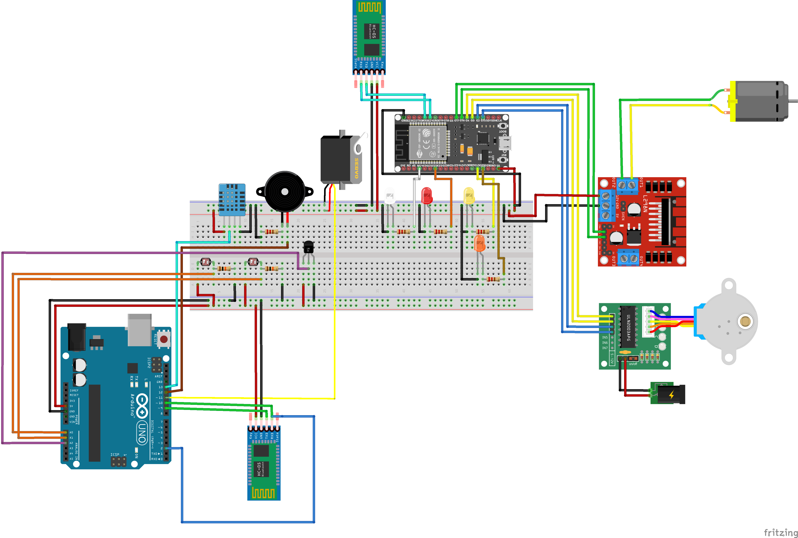

# **Green House Automation Project**

> ## Circuit
>
> The following circuit does not contain the DIY sensors and the pins are not true to the final implementation
> 

### **ESP32 Sensors pins**

-   Bluetooth HC-05

    | Sensor Pin | Microcontroller Pin |
    | ---------- | ------------------- |
    | EN         | Not Connected       |
    | VCC        | 3.3V                |
    | GND        | GND                 |
    | TXD        | Board Pin           |
    | RXD        | Board Pin           |
    | State      | Not Connected       |

### **Arduino Sensors pins**

-   Bluetooth HC-05

    | Sensor Pin | Microcontroller Pin |
    | ---------- | ------------------- |
    | EN         | Not Connected       |
    | VCC        | 3.3V                |
    | GND        | GND                 |
    | TXD        | Board Pin           |
    | RXD\*      | Board Pin           |
    | State      | Not Connected       |

    \*RXD is also connected with D2 interrupt pin

> ## External Libraries

1. DHT Library (Moving out if this library to Adafruit version)
    - [Arduino playground](https://github.com/RobTillaart/Arduino/tree/master/libraries/DHTlib)
    - [Github](https://github.com/RobTillaart/Arduino/tree/master/libraries/DHTlib)
2. ESP32 SoftwareSerial
